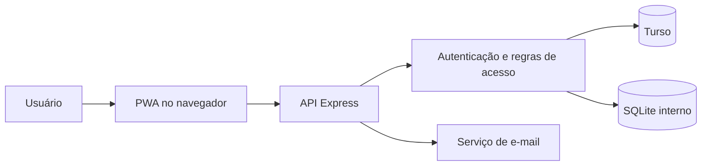

# Hiperion Protocolos

Sistema interno da Hiperion Assessoria Contábil para emissão, transporte, retirada e conferência de documentos.

O projeto reúne protocolos com QR Code, assinatura de recebimento, etiquetas, vencimentos, notificações e rastreabilidade operacional. A mesma aplicação pode operar na nuvem com Vercel e Turso ou na rede interna com Node.js e SQLite.

## Principais recursos

- emissão de protocolos com múltiplos documentos e competências;
- cadastro e pesquisa de empresas por nome ou box;
- atribuição de responsáveis e controle de acesso por perfil;
- confirmação por QR Code ou número do protocolo em contingência;
- assinatura, registro de data e evidência opcional de localização;
- etiquetas A4 e impressão direta para envelopes;
- alertas de vencimento e comprovantes por e-mail;
- retiradas com coleta em campo e conferência pela Legalização;
- histórico, cancelamento, exclusão recuperável e auditoria.

## Perfis e responsabilidades

| Perfil | Responsabilidade |
| --- | --- |
| Administrador | Configuração, usuários, exclusões e visão completa |
| Emissor | Criação e acompanhamento de solicitações |
| Entregador | Entregas e coletas atribuídas |
| Legalização | Emissão, coleta e conferência final de retiradas |

As permissões são verificadas pela API. Ocultar um botão na interface nunca é tratado como controle de segurança.

## Arquitetura



- `server-turso.js`: execução hospedada na Vercel;
- `server.js`: execução em servidor interno;
- `public/`: interface, PWA, impressão e leitura de QR Code;
- `lib/`: regras compartilhadas de entrega, retirada e e-mail;
- `scripts/`: migração, verificação, backup e manutenção;
- `tests/`: testes isolados, sem uso do banco operacional.

Detalhes e decisões estão em [Arquitetura](docs/ARQUITETURA.md).

## Execução local

Requisitos: Node.js 24 ou superior e npm.

```powershell
npm ci
Copy-Item .env.example .env
npm run start:internal
```

O ambiente interno usa `SQLITE_DATABASE_PATH`. Não mantenha o banco em OneDrive, pasta compartilhada ou dentro de um diretório publicado pelo servidor web.

Para validar sem alterar dados operacionais:

```powershell
npm test
npm run verify:internal
```

## Nuvem

A publicação usa Vercel e Turso. Configure no ambiente de hospedagem:

- `TURSO_DATABASE_URL` e `TURSO_AUTH_TOKEN`;
- `RESEND_API_KEY` e `EMAIL_FROM`, quando houver envio de e-mail;
- `CRON_SECRET`, para proteger a rotina de vencimentos;
- `ALLOWED_ORIGINS`, somente se existir uma interface em outro domínio.

Credenciais reais, bancos e arquivos `.env` não pertencem ao Git.

## Documentação

- [Arquitetura de software](docs/ARQUITETURA.md)
- [Fluxos operacionais](docs/FLUXOS.md)
- [Design system](docs/DESIGN-SYSTEM.md)
- [Segurança](docs/SEGURANCA.md)
- [Retiradas de documentação](docs/retiradas.md)
- [Implantação em servidor interno](docs/IMPLANTACAO-SERVIDOR-INTERNO.md)
- [Checklist para a TI](docs/CHECKLIST-TI.md)

Os materiais diagramados para apresentação estão em [`output/pdf`](output/pdf).

## Estrutura

```text
public/             interface e recursos da PWA
lib/                regras e integrações compartilhadas
banco/              acesso ao SQLite; dados locais não são versionados
scripts/            manutenção, migração e backup
tests/              testes automatizados
docs/               documentação técnica e operacional
output/pdf/         documentos para apresentação
server-turso.js     entrada do ambiente Vercel/Turso
server.js           entrada do servidor interno/SQLite
```

## Licença

Software proprietário de **Guilherme Andrade dos Santos Trevisan**. A presença do código neste repositório não concede permissão de uso, cópia, modificação, redistribuição ou exploração comercial. Consulte [LICENSE](LICENSE).

**Copyright © 2026 Guilherme Andrade dos Santos Trevisan. Todos os direitos reservados.**
