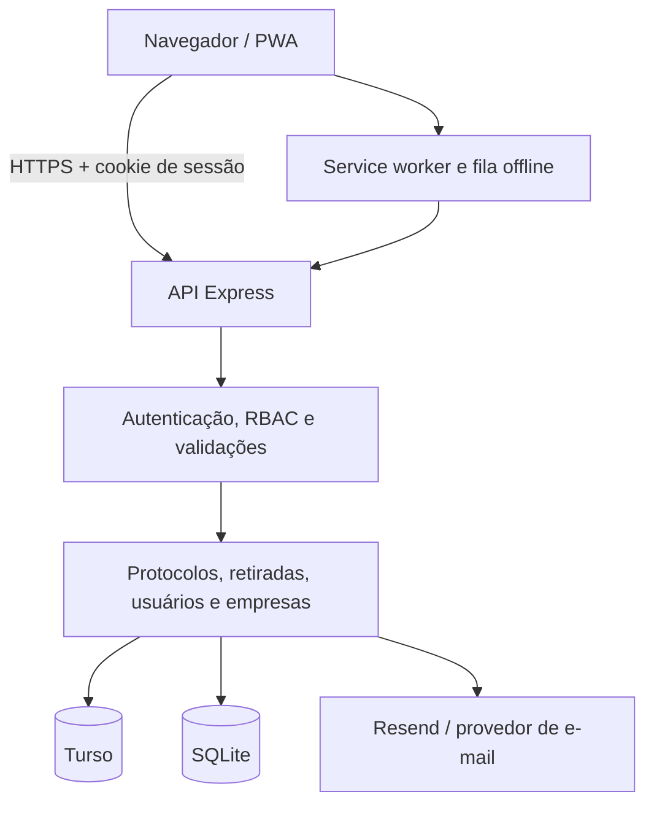
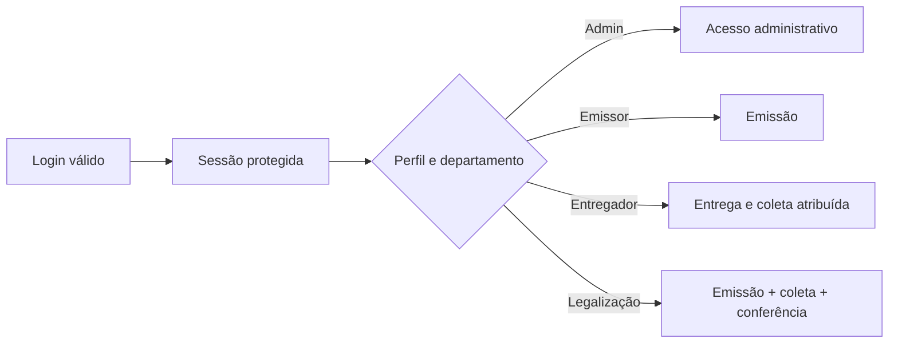

# Arquitetura de software

## Visão geral

O Hiperion Protocolos é uma aplicação web monolítica em Node.js, com interface PWA e duas opções de persistência. A versão hospedada usa Vercel e Turso; a instalação interna usa SQLite no próprio servidor.

## Componentes

| Componente | Função |
| --- | --- |
| `public/index.html` | Aplicação principal, formulários, painéis e impressão |
| `public/offline.js` | Cache e sincronização das operações suportadas |
| `public/pickups.js` | Interface do fluxo de retiradas |
| `public/delivery-settings.js` | Regras administrativas de GPS e QR Code |
| `server-turso.js` | API da instalação hospedada |
| `server.js` | API da instalação interna |
| `lib/delivery-policy.js` | Validação da evidência de entrega/coleta |
| `lib/pickups.js` | Estados, permissões e notificações de retirada |
| `lib/email.js` | E-mails transacionais |
| `banco/db.js` | Inicialização e evolução do SQLite |

## Domínios de negócio

- **Usuários e sessões:** identidade, credenciais, perfil, departamento e expiração.
- **Empresas:** dados de destino, box e destinatários de comprovantes.
- **Protocolos:** emissão, itens, QR, entrega, cancelamento e exclusão.
- **Retiradas:** solicitação, coleta, evidência e conferência documental.
- **Configurações:** GPS, confirmação manual e exigência de QR Code.
- **Vencimentos:** itens pendentes e controle de alertas já enviados.

## Autorização

O servidor decide a autorização em cada rota. As regras de interface servem apenas para orientar o usuário.

## Persistência e paridade

As duas entradas de servidor oferecem os mesmos fluxos, mas usam adaptadores diferentes. Mudanças de regra precisam ser validadas em ambos os ambientes. As migrações são aditivas: colunas e tabelas ausentes são criadas sem apagar registros existentes.

O modo interno exige um único processo gravador por arquivo SQLite. O banco não deve ficar em armazenamento sincronizado ou compartilhamento de rede.

## Integrações

- **Turso:** banco remoto da versão hospedada.
- **Vercel:** execução serverless, arquivos estáticos e cron diário.
- **Resend:** comprovantes e notificações; pode ser substituído por outro provedor.
- **Geolocation API:** captura pontual, condicionada à configuração e permissão.
- **QR Scanner:** biblioteca distribuída localmente para reduzir dependência externa.

## Limites conhecidos

A interface principal e parte das rotas ainda estão concentradas em arquivos grandes. A duplicação dos servidores reduz dependências na implantação, mas aumenta o cuidado necessário para manter paridade. Uma evolução segura deve extrair módulos compartilhados gradualmente e manter testes de contrato para as duas persistências.
