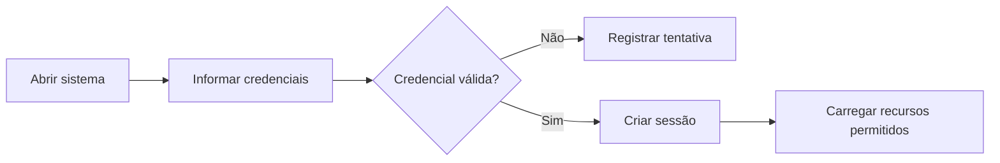
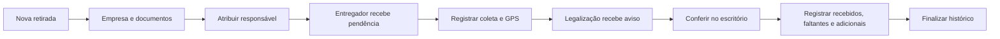
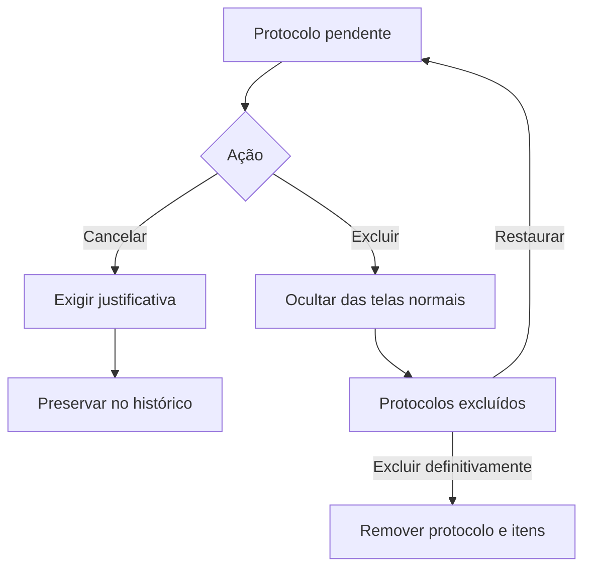
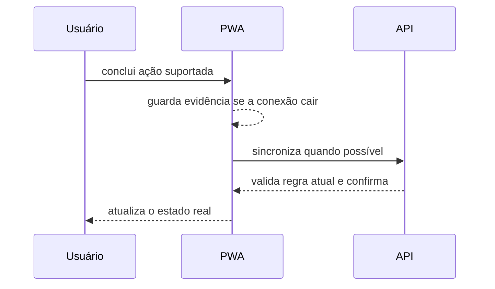

# Fluxos operacionais

## Acesso

## Protocolo de entrega

```mermaid
flowchart LR
    A[Nova solicitação] --> B[Selecionar empresa]
    B --> C[Definir responsável]
    C --> D[Adicionar documentos]
    D --> E[Gerar protocolo e QR]
    E --> F[Imprimir etiqueta]
    F --> G[Entregar]
    G --> H[QR ou número de contingência]
    H --> I[Nome e assinatura]
    I --> J[Registrar comprovante]
    J --> K[Enviar e-mail]
```

A falha do e-mail não desfaz a entrega. O status do envio permanece associado ao protocolo.

## Retirada de documentos

A retirada não gera número de protocolo nem etiqueta. Somente o responsável atribuído registra a coleta; Legalização ou administrador conclui a conferência.

## Cancelamento e exclusão

Exclusão definitiva e exclusão de retiradas são operações exclusivas do administrador.

## Operação offline

Retiradas exigem conexão. A fila offline é reservada aos fluxos de protocolo já suportados.
